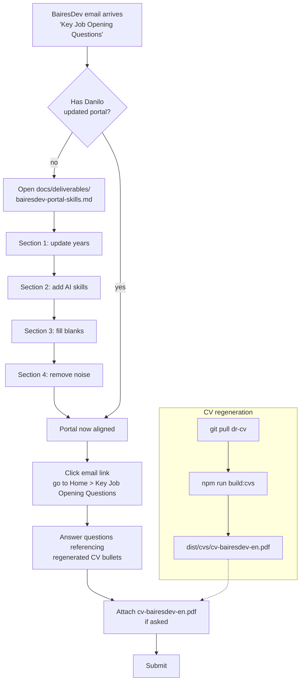

# BairesDev CV v2 + Portal Skills Inventory — Design Spec

**Date:** 2026-05-12
**Author:** Danilo Rojas (with Claude as operator)
**Status:** Brainstorming complete → ready for writing-plans
**Companion:** `2026-05-12-bairesdev-cv-v2-design.html` (for human review)
**Predecessor:** `2026-05-07-phase2-cv-generators-design.md` (CV generators, shipped)

---

## Problem

BairesDev (Danilo's current employer) triggered a staffing-questionnaire flow on 2026-05-12 through Fernanda Siriani (Hiring Journey Analyst TTP). Each incoming email will ask Danilo to answer "Key Job Opening Questions" for a specific position.

Two artifacts drive how BairesDev sells Danilo to their US enterprise clients:

1. **The BairesDev portal skills inventory** — a taxonomy-bound list (skill + years) that their matching system uses to route positions. Danilo has already declared skills there, with several inconsistencies (e.g. HTML 4+, JavaScript 1+, Agile 4+ — lower than reality) and blanks (several "Select years" rows).
2. **The BairesDev CV variant** — `dist/cvs/cv-bairesdev-en.{html,pdf}`, generated by `generators/templates/cv/bairesdev.ts`, currently positions Danilo as "Agentic Designer · Product Engineer" with thesis *"I ship real products — and I ship the tools agents use to help me ship them."*

The tension: the portal reads like a conservative mid-senior frontend + UX/UI generalist. The CV reads like a founder-operator. A recruiter comparing the two detects dissonance. Worse — the portal under-represents Danilo's actual years (HTML/JS 10+, Figma 8+, Agile 10+) and lacks AI/agentic skills entirely, so BairesDev's matching engine will never route him to AI-forward positions.

## Goal

Two aligned deliverables that make a recruiter say *"this person I have to hire no matter what"* while preserving Danilo's agentic-forward positioning:

1. **Deliverable A — Regenerated BairesDev CV** (`dist/cvs/cv-bairesdev-en.{html,pdf}`), agentic-forward in the sidebar and thesis, with a *Skills Inventory* block on page 2 that matches the BairesDev portal format (skill + years). The CV narrates Danilo as an agentic operator who also happens to have 15 years of shipping UX/UI and frontend.
2. **Deliverable B — Portal skills update checklist** (`docs/deliverables/bairesdev-portal-skills.md`), a Markdown document that lists every edit Danilo must perform in the BairesDev portal: years to correct on declared skills, new skills to add, skills to remove, and blanks to fill. Each entry has a one-line justification so Danilo can defend it in interview.

## Non-goals

- NOT generating a new CV variant. We modify the existing `renderBairesdevCv` generator and its data inputs.
- NOT changing positioning for the other two variants (`warm`, `serious`) — they keep their existing thesis and structure.
- NOT adding a new data file if an existing one can be extended. Skills inventory years live in a new field on existing `data/skills.yaml`.
- NOT auto-submitting anything to the BairesDev portal. Deliverable B is a checklist Danilo executes manually.
- NOT touching Phase 1 (skills sheet) or Phase 3 (landing). Scope is this single CV variant + one new Markdown deliverable.

## Architectural decisions

### Decision 1 — Positioning: agentic-forward, frontend as reinforcement

Danilo's explicit direction: *"lo más importante para mí es dar esa perspectiva AI"*. Agentic framing leads; UX/UI + frontend appear lower as corroboration of the 15-year shipping track record.

**New thesis (EN):** *"Agentic Designer. 15 years delivering product — today I ship SaaS, design systems, and frontend with agents as force multiplier."*

### Decision 2 — Sidebar: agentic group first, inventory on page 2

The sidebar on page 1 keeps its four groups but reorders them so `Agents & AI-Assisted Delivery` is first, then `Design & Systems`, `Engineering`, `Strategy`. The existing `Strategy / Design / Engineering / Agents` groups in `data/skills.yaml` get relabeled and reordered; no items removed.

A new `Skills Inventory` block appears on page 2, above `Past Experience`, formatted as a compact 2-column `skill · years` grid that mirrors the BairesDev portal taxonomy. This is what the recruiter scans for matching.

### Decision 3 — Skills inventory baseline: "Realista amplio"

For AI / agentic skills, count honest years of practice (including pre-Claude-Code LLM work). For classical skills, count from first documented professional use (Tecniequipos 2013 for JS/HTML/PHP, Xentinels 2016 for Figma/DS/Agile).

## Deliverable A — Regenerated BairesDev CV

### File changes

| File | Change |
|---|---|
| `data/positioning.yaml` | Add `thesisBairesdev.en` field with the new agentic-forward thesis. Keep existing `thesis` for warm/serious variants. |
| `data/skills.yaml` | Add `inventory` root key: an ordered list of `{ skill, years, notes? }` matching the BairesDev portal taxonomy. |
| `generators/lib/types.ts` | Extend `PositioningData` with optional `thesisBairesdev`. Extend `SkillsData` with `inventory`. |
| `generators/lib/load-data.ts` | Parse the two new fields. |
| `generators/templates/cv/components/skills-sidebar.ts` | When `variant === "bairesdev"`, render groups in order `Agents → Design → Engineering → Strategy`. Relabel `Agents` heading to `Agents & AI-Assisted Delivery`. No changes for other variants. |
| `generators/templates/cv/bairesdev.ts` | Use `data.positioning.thesisBairesdev.en ?? data.positioning.thesis.en` in `renderSummaryBairesdev`. Add a new `renderSkillsInventory(inventory)` section on page 2, inserted between `renderEducationBlock` (left column) and `Past Experience` (right column). |
| `tests/cv-bairesdev.test.ts` | Add assertions for the new thesis text, the inventory block presence, the sidebar reorder. |

### Layout change on page 2

Current page 2 has:
- Left column (aside): `Education`
- Right column (`.cv-right`): `Past Experience` + `References`

New page 2 has:
- Left column (aside): `Education` + `Skills Inventory`
- Right column (`.cv-right`): `Past Experience` + `References`

The `Skills Inventory` block uses a two-column `grid-template-columns: 1fr auto` where skill name is left-aligned and years right-aligned in mono font — same visual system as the `cv-edu__item` rows, so it reads as a continuation of the aside.

### Component contract

```ts
// new function in generators/templates/cv/components/skills-inventory.ts
interface SkillInventoryItem {
  skill: string;    // display label
  years: string;    // "10+", "4+", "<1", "0"
  notes?: string;   // optional one-line context for hover/print (omitted in v1)
}

export function renderSkillsInventory(
  items: SkillInventoryItem[],
  lang: "en" | "es"
): string
```

Renders a `<section class="cv-inventory">` with heading `Skills Inventory` / `Inventario de skills`, a `<dl>` or grid of rows. One component, consumed only by the bairesdev variant for now.

### Data contract

```yaml
# data/skills.yaml (new section, appended)
inventory:
  - { skill: "UX/UI", years: "10+" }
  - { skill: "HTML", years: "10+" }
  - { skill: "CSS", years: "10+" }
  - { skill: "JavaScript", years: "10+" }
  - { skill: "Agile Methodologies", years: "10+" }
  - { skill: "Sales / Business Development", years: "5+" }
  - { skill: "Figma", years: "8+" }
  - { skill: "Git / GitHub", years: "5+" }
  - { skill: "React", years: "4+" }
  - { skill: "SASS", years: "5+" }
  - { skill: "SEO", years: "4+" }
  - { skill: "TypeScript", years: "3+" }
  - { skill: "SQL", years: "3+" }
  - { skill: "REST API", years: "3+" }
  - { skill: "Graphic Design", years: "3+" }
  - { skill: "Photoshop", years: "3+" }
  - { skill: "Next.js", years: "2+" }
  - { skill: "Tailwind CSS", years: "2+" }
  - { skill: "Supabase", years: "2+" }
  - { skill: "PostgreSQL", years: "2+" }
  - { skill: "REST", years: "2+" }
  - { skill: "Artificial Intelligence", years: "2+" }
  - { skill: "Prompt Engineering", years: "2+" }
  - { skill: "LLM Integration", years: "2+" }
  - { skill: "AI Agents", years: "1+" }
  - { skill: "Anthropic Claude API", years: "1+" }
  - { skill: "Vercel", years: "1+" }
  - { skill: "Illustrator", years: "4+" }
  - { skill: "WordPress", years: "4+" }
```

### Thesis copy

```yaml
# data/positioning.yaml (new field)
thesisBairesdev:
  en: "Agentic Designer. 15 years delivering product — today I ship SaaS, design systems, and frontend with agents as force multiplier."
```

## Deliverable B — Portal skills update checklist

A new Markdown file `docs/deliverables/bairesdev-portal-skills.md` that Danilo opens alongside the BairesDev portal and executes step-by-step. Four sections:

### Section 1 — Update years on already-declared skills

Skills currently in Danilo's portal with years that under-represent his actual experience. Table columns: *Skill · Current · New · Reason*.

| Skill | Portal | Update to | Reason |
|---|---|---|---|
| Sales/Business Development | 10+ | **5+** | More honest for formal business-dev work |
| Agile Methodologies | 4+ | **10+** | Xentinels 2016–present + BAH + EnRegla |
| HTML | 4+ | **10+** | Since Tecniequipos 2013 |
| CSS | 4+ | **10+** | Since Tecniequipos 2013 |
| JavaScript | 1+ | **10+** | Since Tecniequipos 2013 |
| Figma | 2+ | **8+** | Xentinels DS work and Behance portfolio |
| React | 1+ | **4+** | EnRegla + prior client work |
| TypeScript | 1+ | **3+** | EnRegla + dr-cv |

### Section 2 — Add new skills (the "must-hire" tier)

Danilo adds these from the portal search. Several are not in the default taxonomy and may show up as close matches (e.g. "Anthropic Claude API" vs "Claude Code"). The checklist instructs him on which variant to pick if exact match absent.

| Skill | Years | Reason |
|---|---|---|
| Artificial Intelligence | 2+ | Diferenciador principal; 2 años de práctica documentada |
| Prompt Engineering | 2+ | Core skill para el pitch agentic |
| LLM Integration | 2+ | EnRegla + Life Update Mobile (Gemini runtime) |
| AI Agents / Agentic AI | 1+ | Claude Code subagent orchestration |
| Anthropic Claude API | 1+ | Ya identificado por Danilo como búsqueda alterna |
| Next.js | 2+ | Stack moderno del portfolio dr-cv |
| Tailwind CSS | 2+ | Landing v11, dr-cv |
| Supabase | 2+ | EnRegla (346 commits, 21 migrations) |
| PostgreSQL | 2+ | Vía Supabase, SQL + RLS |
| Vercel | 1+ | Deployment para dr-cv y pruebas EnRegla |

### Section 3 — Fill "Select years" blanks

| Skill | Years | Reason |
|---|---|---|
| Photoshop | 3+ | Uso ocasional en Xentinels/Arpatel |
| SASS | 5+ | Xentinels DS stack |
| SEO | 4+ | Tecniequipos + trabajo freelance web |
| Soft Skill - Leadership | 10+ | Xentinels team lead + BAH consulting |
| Soft Skill - Planning | 10+ | Roadmapping y RICE consistentes |
| REST | 2+ | EnRegla edge functions + prior client work |
| Unit Testing | 2+ | dr-cv (158 tests) + EnRegla |
| Webpack | 2+ | Vía Next.js/Vite toolchain |
| Redux | 1+ | Cliente previo |
| Node.js | 2+ | Edge functions en EnRegla |
| npm | 10+ | Cliente previo y projects actuales |

### Section 4 — Remove / leave blank

| Skill | Action | Reason |
|---|---|---|
| Machine Learning | Do NOT add | Sin research formal; se puede defender por AI general |
| Silverlight | Remove | Obsoleto, no aporta signal |
| Scala | Remove | No aporta signal |
| Grunt | Leave blank | Obsoleto; no inflar |
| gulp.js | Leave blank | Obsoleto |
| AJAX | Leave blank | Cubierto por REST/JS |
| XML | Leave blank | No diferenciador |
| C/C++ | Leave blank | Sin práctica reciente |
| iOS Developer 2+ | Review manually | Validar si es honesto; si no, remover |
| Android Developer <1 | Leave as-is | Honesto, no subir |
| Vue.js <1 | Leave as-is | Honesto |
| InVision 0 | Remove | Herramienta muerta |

Each section ends with a "Post-update verification" line: Danilo refreshes the portal home page and confirms the skill count went from N to N+k.

## Testing

- `tests/cv-bairesdev.test.ts` — three new assertions:
  1. HTML output contains the new thesis string.
  2. HTML contains a `<section class="cv-inventory">` with at least 20 skill rows.
  3. Sidebar `Agents & AI-Assisted Delivery` group appears before `Design` group in the rendered order.
- `tests/data.test.ts` — one new assertion: `skills.yaml` exports `inventory` as a non-empty array.
- Visual verification: open `dist/cvs/cv-bairesdev-en.html` in a browser, confirm 2-page layout is preserved, skills inventory fits without overflow.

## Success criteria

1. `npm run build:cvs` regenerates `cv-bairesdev-en.{html,pdf}` with the new thesis and skills inventory without breaking the other two CV variants.
2. The two-page layout stays intact — no orphan page 3.
3. All three test files pass.
4. The Markdown checklist `docs/deliverables/bairesdev-portal-skills.md` exists, is committed, and is readable as a standalone document without needing this spec for context.
5. A recruiter reading both the CV and the portal sees a consistent story: agentic operator with deep UX/UI + frontend heritage, now leveraging AI for delivery.

## Open questions

None — all decisions locked in brainstorming.

## User flow


