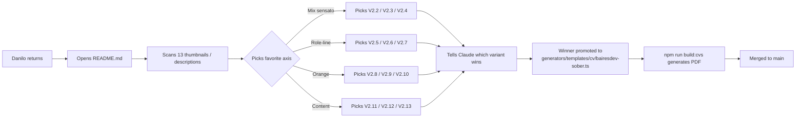

# Sober-Enterprise V2.1 base + 12 exploration variants

**Date:** 2026-05-12
**Author:** Danilo Rojas (operator: Claude)
**Status:** Brainstorming → ready for implementation
**Source prompt (verbatim):** `docs/prompts/2026-05-12-sober-v2-feedback.md`
**Predecessor:** `docs/superpowers/visuals/2026-05-12-sober-enterprise-variants/V2-industries-first.html` (exploratory mockup, Danilo approved direction)

---

## Problem

Danilo approved the V2 *Industries First* direction as the closest to what he wants for BairesDev end-clients that are NOT tech/SaaS (conservative, regulated, Kinder-Morgan-shaped). V2 was a rough mockup; Danilo reviewed it carefully and returned detailed feedback on copy, layout, typography, branding, and case-card chrome. He also asked for 12 exploration variants across 4 axes so he can pick the final direction at his own pace.

This spec captures the feedback as V2.1 (the refined base), then defines 12 variants that explore orthogonal axes on top of V2.1. Nothing merges to `main` — the branch `feat/sober-enterprise-explorations` holds everything until Danilo chooses.

## Goal

Thirteen self-contained standalone HTML mockups inside `docs/superpowers/visuals/2026-05-12-sober-enterprise-variants/v2-1/`:

- `V2-1-base.html` — V2 with all approved feedback applied
- `V2-2-mix-proof-numbers.html`, `V2-3-mix-role-alt.html`, `V2-4-mix-orange-assertive.html` — Axis 1: "mix sensato" (controller's diverse picks)
- `V2-5-role-senior-agentic-design.html`, `V2-6-role-ds-agentic-delivery.html`, `V2-7-role-senior-agentic-practice.html` — Axis 2: role-line headline formulations
- `V2-8-orange-quiet.html`, `V2-9-orange-moderate.html`, `V2-10-orange-assertive.html` — Axis 3: orange intensity
- `V2-11-content-industries.html`, `V2-12-content-numbers.html`, `V2-13-content-compliance.html` — Axis 4: content emphasis

All 13 are browser-openable, no build step. Written by extending the existing `_generate.mjs` script. A `README.md` indexes them with the scan-test rubric for Danilo.

## Non-goals

- NOT creating a generator variant in `generators/templates/cv/`. These are exploration mockups. The winner becomes the generator variant in a later task.
- NOT touching the already-merged AI-forward `bairesdev` variant on `main`.
- NOT merging anything until Danilo picks a winner.
- NOT writing tests (mockups, not production code).
- NOT producing PDFs. HTML only. PDF rendering happens when we ship the winner as a real generator variant.

## Architecture

Single Node ESM script `_generate.mjs` (extends the existing one at `docs/superpowers/visuals/2026-05-12-sober-enterprise-variants/_generate.mjs`) renders all 13 HTMLs from shared data + per-variant config. Pure string templating; no framework, no deps. Keeps each variant readable side-by-side and makes iteration fast (edit one file, regenerate all).

### Shared module contents (one file, `_generate.mjs`)

1. **Tokens block** — orange `#FF8964`, ink scale, line scale, font stack. Single source.
2. **Shared CSS block** — identity, summary, industries band, sidebar (skills + in-progress + clients), main column, case cards (NO border), orange-dot accent, professional experience with mono UPPERCASE role line, education with unified typography, references.
3. **Data block** — identity, contact, industries list (full names), skills groups (including new "In progress"), clients, experience items (BAH dated 2022—Present), education, Selected Work cases (BAH + Banco Pichincha with orange-dot markers, no border).
4. **Render helpers** — `head()`, `renderIdentity(roleLine)`, `renderIndustriesBand()`, `renderSkillsSidebar(extraGroups?)`, `renderClientsSidebar()`, `renderExperience(items)`, `renderCase(case, { variantClasses })`, `renderProofBand()`, `renderEducation()`, `renderReferences()`, `renderSummary({ thesis, size })`.
5. **Variant configs** — each of the 13 variants is a config object consumed by a generic `renderVariant(config)` that wires the pieces. Axes-specific CSS classes (`.variant-v2-8`, `.variant-v2-9`, etc.) toggle the differentiating treatment.

### Orange accent rules (baseline in V2.1)

- One small orange dot (6px) beside each Selected Work company name.
- One small orange `▸` on each reference list item.
- The `//` section-heading prefix stays orange (carried from V2).
- The industries-label `// industries served` stays orange.
- That's it. Nothing else tinted orange in V2.1. Axis 3 (intensity) varies this.

### Typography unification (rule for all 13)

- Two font families only: `Inter` and `JetBrains Mono`. No third.
- The following are ALL rendered as `font-family: mono; font-size: 7pt; letter-spacing: 0.14em; text-transform: uppercase; color: var(--ink)` — they must look identical:
  - Selected Work `.cv-case__meta` (client + year)
  - Professional Experience `.cv-xp__role` (role title)
  - Professional Experience `.cv-xp__dates`
  - Education `.cv-edu__year` and `.cv-edu__name`'s mono counterpart
- Thesis size drops from 13pt → 11pt.
- Education no longer uses its own font treatment. Same scale as the rest of the mono block.

### V2.1 content decisions (the base)

- **Role line (single line):** `Senior Product Designer · Agentic Design` [left] — `15 years of experience` [right]. "Design Systems" and "Accessibility" do NOT appear in the role line. They are skills, not identity.
- **Industries band:** `Department of Defense · Banking · Pharmaceuticals · Consumer goods · Government · Energy (regulated)`. "DoD adjacent" removed; "Energy" gets the parenthetical `(regulated)` because it's useful signal for oil & gas readers without claiming operator experience.
- **Thesis (smaller):** "Fifteen years delivering design in regulated industries — defense, banking, pharmaceuticals, consumer goods. Design systems as governance. Accessibility as compliance. Documentation as handoff discipline."
- **BAH experience dates:** `2022 — Present` (4 years).
- **Selected Work cases:** BAH + Banco Pichincha. No rectangle border. Orange dot `●` beside each company name inline with the meta row.
- **Sidebar skills:** add new group `In progress`. Initial list (pulled from the BairesDev-warm / AI-forward sidebar and filtered to what's honest AND matters to this archetype): `SAP / Oracle UX patterns`, `Power BI dashboards`, `Offline-first field ops`, `Azure M365 integration depth`, `SharePoint SPA at scale`. Pills rendered with dashed border to signal "learning".
- **Enterprise Clients / Education spacing:** 6mm gap between the two blocks in the sidebar (was ~2mm).

All 12 variants inherit V2.1 unless their axis says otherwise.

## The 12 variants (axis-by-axis)

### Axis 1 — Mix sensato (controller's picks for maximum variety)

- **V2.2 · `mix-proof-numbers`** — V2.1 + a proof-number band under the thesis: `15+` years / `8+` enterprise clients / `10` years DS governance. Numbers in orange (from landing v11 signature).
- **V2.3 · `mix-role-alt`** — V2.1 with role line changed to `Senior Product Designer + Agentic Delivery` (tests whether "Delivery" reads more industrial than "Design"). Everything else identical.
- **V2.4 · `mix-orange-assertive`** — V2.1 with assertive orange: dots grow to 8px, bullet-markers on bullets tinted orange, references list marker tinted orange, industries label orange+bold. Tests maximum branding without crossing into tech/SaaS vibe.

### Axis 2 — Role-line headline formulations

- **V2.5 · `role-senior-agentic-design`** — `Senior Product Designer · Agentic Design` (same as V2.1 baseline but isolated here for A/B comparison).
- **V2.6 · `role-ds-agentic-delivery`** — `Product Designer — Design Systems & Agentic Delivery` (wider, signals DS explicitly, uses em-dash).
- **V2.7 · `role-senior-agentic-practice`** — `Senior Product Designer (Agentic practice)` (parenthetical — subtlest Agentic mention).

### Axis 3 — Orange accent intensity

- **V2.8 · `orange-quiet`** — remove all orange accents except one 28mm hairline under the name (V1-Quiet style). `//` prefixes stay in muted gray. No orange dots on cases.
- **V2.9 · `orange-moderate`** — V2.1 baseline level.
- **V2.10 · `orange-assertive`** — same as V2.4, kept in both axes so Danilo sees it in the intensity-only comparison.

### Axis 4 — Content emphasis

- **V2.11 · `content-industries`** — V2.1 baseline (industries band is the lead signal).
- **V2.12 · `content-numbers`** — remove industries band. Add proof-number band in its place (same as V2.2). Thesis slightly rewritten to lean into numbers.
- **V2.13 · `content-compliance`** — remove industries band. Add a per-role compliance `▸` bullet on every role in Professional Experience (same treatment as V4 in the original 4-variant set). Thesis rewritten to open with "Compliance" instead of "Industries".

## Testing

No automated tests. Manual verification:

1. Open each of the 13 HTML files in a browser.
2. Confirm layout renders at A4 width.
3. Confirm orange token `#FF8964` appears in the rendered CSS (grep).
4. Confirm every variant has: BAH dates = 2022, no case-card border, orange dot beside companies (except V2.8), `Department of Defense` spelled out, "In progress" skills group.

## Success criteria

1. 13 HTML files exist at the specified paths.
2. A `README.md` alongside them explains the 12-variant comparison and includes a "how to decide" rubric tailored to BairesDev end-client scanning behavior.
3. Memory (`project_bairesdev_conservative_archetype.md`) is updated with the new nuance: subtle Agentic mention in role line is acceptable; Accessibility is demoted from headline to compliance item.
4. Branch `feat/sober-enterprise-explorations` holds everything with descriptive commits; nothing merged.
5. No tests broken on `main` (we're not touching `main`).

## Open questions

None. Danilo's instruction was explicit: one round of questions (answered), then execute to approval without interrupting.

## User flow

