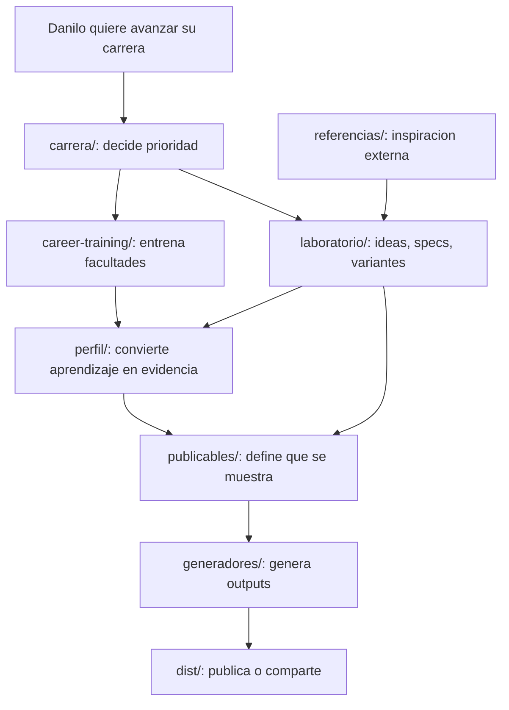

# Carrera Pro Repo Restructure Design

**Fecha:** 2026-06-11
**Repo:** `C:\dev\dr-cv`
**Estado:** Aprobada e implementada
**Objetivo:** convertir `dr-cv` en una maquina de carrera entendible, no solo una fabrica de CV/landing.

## Principio rector

El repo se ordena por **proposito de carrera**. Lo publicable vive dentro de la maquina de carrera, pero no manda la estructura.

```text
carrera/ -> career-training/ -> perfil/ -> publicables/ -> generadores/ -> dist/
decision     facultades          evidencia   salidas        build           output
```

## Estructura final

```text
dr-cv/
|-- carrera/          Centro de mando: plan, semana, daily, decisiones.
|-- career-training/  Training de facultades senior; fuente de /app.
|-- perfil/           Fuente de verdad profesional: data + assets propios.
|-- publicables/      CV, landing, skills sheet, social posts.
|-- generadores/      Codigo que genera HTML/PDF/site.
|-- design-system/    Un design system activo con targets print/web.
|-- dist/             Outputs generados; raiz deployada: dist/landing-v11.
|-- laboratorio/      Specs, plans, visuals, audits, exploraciones.
|-- referencias/      Inspiracion externa read-only.
|-- tests/            Vitest suite de los generadores.
`-- node_modules/     Dependencias instaladas.
```

## Traduccion aplicada

| Antes | Ahora |
|---|---|
| `estrategia/` | `carrera/` |
| `UR_training/starting_point/` | `career-training/ur-assessment/` |
| `data/` | `perfil/data/` |
| `assets/` | `perfil/assets/` |
| `productos/` | `publicables/` |
| `generators/` | `generadores/` |
| `pruebas/` | `laboratorio/` |
| `design-system/tokens.css` | `design-system/tokens-print.css` |
| `design-system/tokens-v11.css` | `design-system/tokens-web.css` |

## Contratos por carpeta

### `carrera/`

Responde: "Que hago ahora y por que?"

Contiene plan maestro, semana actual, metricas, reviews, decisiones y `daily/index.html`.

### `career-training/`

Responde: "Que facultades estoy entrenando?"

Contiene assessment, preguntas, respuestas, gaps y futuros planes de capacitacion.

### `perfil/`

Responde: "Que evidencia profesional tengo?"

Contiene:

- `perfil/data/`: identidad, experiencia, casos, skills, testimonials, posicionamiento.
- `perfil/assets/`: foto, animaciones y stills fuente.

### `publicables/`

Responde: "Que le muestro al mundo?"

Contiene documentacion humana y entregables hechos a mano de CV, landing, skills sheet y social posts.

### `generadores/`

Responde: "Como se transforma perfil en publicables?"

Contiene loaders, renderers, templates y scripts TypeScript.

### `design-system/`

Responde: "Cual es el lenguaje visual activo?"

Hay un solo design system con dos targets:

- `tokens-print.css` para CVs y skills sheet.
- `tokens-web.css` para landing y publicables web.

### `dist/`

Responde: "Que se genero?"

No se edita a mano. `dist/landing-v11/` es la raiz publicada por GitHub Pages.

### `laboratorio/`

Responde: "Que probe, descarte o estoy pensando?"

Contiene specs, plans, visuals, audits, prompts y exploraciones historicas.

### `referencias/`

Responde: "Que cosas externas inspiran este trabajo?"

Read-only. Las notas propias van en `referencias/notes/`.

### `tests/`

Responde: "Que protege la maquinaria?"

Contiene tests de data, templates, CVs, landing, tipos y criterios de exito.

## User flow diagram



## Rutas invariantes

- `danilorojas.design/`
- `danilorojas.design/es/`
- `danilorojas.design/work/*`
- `danilorojas.design/app`
- `danilorojas.design/daily`
- `dist/landing-v11/CNAME`

## Criterios de aceptacion

- `npm run build:all` pasa.
- `npm test` pasa.
- `npm run typecheck` pasa.
- `dist/landing-v11/app/index.html` es copia de `career-training/ur-assessment/index.html`.
- `dist/landing-v11/daily/index.html` es copia de `carrera/daily/index.html`.
- Danilo puede saber donde buscar algo en menos de 10 segundos.
