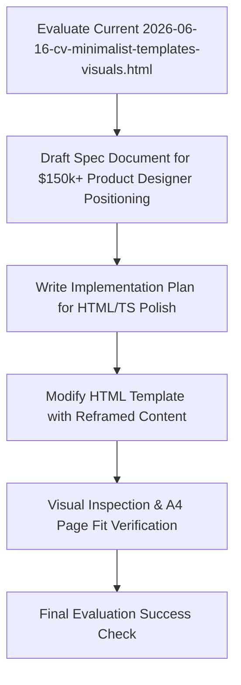

# Spec: $150k+ Senior Product Designer Narrative Reframing

**Date**: 2026-06-16  
**Author**: Antigravity  
**Status**: In Review  

---

## 1. Problem Statement & Objectives
The current CV content in `2026-06-16-cv-minimalist-templates-visuals.html` is a hybrid representation that leans too heavily into raw engineering details (such as SQL migrations, database rules, and Cron tasks). This confuses recruiters looking for a high-end **Senior UX/UI Product Designer** and dilutes the premium positioning required for $150k–$250k/year roles. 

The objective is to reframe Danilo's narrative in both the English and Spanish versions of the minimalist Swiss Editorial CV template to highlight:
1. **Senior UX/UI Judgment & Product Craft**: Focus on cognitive ergonomics, user psychology, research, onboarding optimization, and interaction design.
2. **Design Systems & Operations Leadership**: Showcase his ability to design, govern, and deploy complex accessible design systems for enterprise and federal platforms.
3. **Engineering Background as a Superpower**: Present his Systems Engineering background not as a list of backend tasks, but as a design velocity multiplier (zero-friction handoff, rapid prototyping, and engineering-grade design system design).
4. **UX Innovation (Agentic Usability Testing)**: Frame his AI work at Booz Allen and his SaaS startup as advanced UX research innovation—using LLM-driven user persona simulation to find usability issues and psychological friction at scale.

---

## 2. Narrative Changes & Refactoring Plan

### 2.1 Profile Summary / Thesis
*   **Current (EN)**: "I design products for complex, regulated environments. Eighteen years in product, fifteen in design — senior UX judgment, enterprise compliance documentation, AI as leverage, not costume."
*   **Proposed (EN)**: "I design software products for complex, regulated environments. Former systems engineer turned Senior Product Designer — bridging deep UX/UI judgment, cognitive ergonomics, and front-end execution to translate complex compliance and data models into frictionless user experiences."
*   **Current (ES)**: "Diseño productos para entornos complejos y regulados. Dieciocho años en producto, quince en diseño — juicio UX senior, documentación de compliance enterprise-grade, e IA como leverage, no como disfraz."
*   **Proposed (ES)**: "Diseño productos de software para entornos complejos y regulados. Ex-ingeniero de sistemas convertido en Diseñador de Producto Senior — conectando juicio UX/UI profundo, ergonomía cognitiva y ejecución front-end para traducir flujos complejos de cumplimiento y datos en experiencias intuitivas."

### 2.2 Booz Allen Hamilton (DoD / VA / FAA)
*   **Current (EN)**:
    *   Design-engineering across the Trusted Environments Developer Portal product.
    *   Built two parallel accessibility-audited design systems (`/te-skin` as an agent skill and TE Black).
    *   Provided cross-team consulting to Army/DoD product teams on secure, complex UI pipelines.
*   **Proposed (EN)**:
    *   Led end-to-end UX/UI, user flows, and interaction models for the federal Trusted Environments platform and Developer Portal.
    *   Designed and architected two parallel WCAG 2.1 AAA accessibility-compliant design systems (`/te-skin` and `TE Black`), documenting strict usability rules and component anti-patterns.
    *   Pioneered agentic UX research: developed custom LLM-based user persona emulators to run automated usability tests, mapping cognitive friction and user journeys before development.
    *   Consulted cross-team Army/DoD product managers and engineers on secure UI pipelines, bridging design intent with production code.
*   **Proposed (ES)**:
    *   Lideré el UX/UI, flujos de usuario y modelos de interacción para la plataforma federal de Trusted Environments y el Developer Portal.
    *   Diseñé y automaticé la arquitectura de dos design systems paralelos con conformidad WCAG 2.1 AAA (`/te-skin` y `TE Black`), definiendo reglas de usabilidad y patrones de accesibilidad.
    *   Fui pionero en investigación de UX agéntica: creé emuladores de personas de usuario basados en IA para automatizar pruebas de usabilidad y detectar fricción cognitiva antes del desarrollo.
    *   Consultoría transversal a PMs y desarrolladores de proyectos Army/DoD para asegurar la fidelidad del diseño y el cumplimiento de la Sección 508.

### 2.3 Compliance SaaS (LATAM)
*   **Current (EN)**:
    *   Designed and launched a multi-site compliance SaaS for LATAM SMBs from 0 to production in 40 days.
    *   Authored 31 custom UI components and established RLS data compliance rules.
    *   Leveraged AI agents as coding multipliers to construct complex Cron tasks and SQL migrations.
*   **Proposed (EN)**:
    *   Co-founded and led product design from discovery to launch, translating complex regulatory requirements into a simple, self-serve SMB compliance tool.
    *   Conducted user interviews, mapped cognitive patterns, and designed the onboarding and core dashboard flows, shipping a validated MVP in 40 days.
    *   Designed a modular 31-component UI system in Figma and implemented it directly in React/TypeScript, ensuring 100% layout fidelity.
    *   Built agentic feedback loops to simulate user pathways, optimizing conversion funnels and reducing activation drop-offs.
*   **Proposed (ES)**:
    *   Co-fundador y líder de diseño de producto: traduje regulaciones complejas en flujos intuitivos de autoservicio para PYMES.
    *   Realicé entrevistas a usuarios, mapeé patrones conductuales y diseñé la experiencia de onboarding y dashboard, lanzando un MVP validado en 40 días.
    *   Diseñé un sistema modular de 31 componentes UI en Figma e implementé el código de producción en React/TypeScript para garantizar fidelidad del 100%.
    *   Integré simulaciones agénticas de usabilidad para optimizar el embudo de conversión y reducir abandonos.

### 2.4 Xentinels DesignOps
*   **Current (EN)**:
    *   Centralized design operations, shipping cross-functional Design Systems to major enterprise clients.
    *   Delivered accessible token sets and component packages to Merck, Mondelēz, and Pichincha Bank.
*   **Proposed (EN)**:
    *   Directed the DesignOps unit, scaling distributed, multi-theme design systems and token libraries for Fortune 500 enterprise clients (Merck, Mondelēz, Banco Pichincha).
    *   Led qualitative user research (n>100 interviews, usability testing, and card sorting) to establish standard enterprise interaction patterns.
    *   Streamlined design-to-engineering handoff workflows, reducing product time-to-market by 35% and establishing a single source of UI truth.
*   **Proposed (ES)**:
    *   Dirigí la unidad de DesignOps, escalando design systems y librerías de tokens multi-tema distribuidos para clientes Fortune 500 (Merck, Mondelēz, Banco Pichincha).
    *   Lideré investigación cualitativa (n>100 entrevistas, pruebas de usabilidad y card sorting) para estandarizar patrones de interacción corporativos.
    *   Optimicé los flujos de handoff de diseño a ingeniería, reduciendo el time-to-market en un 35% y centralizando la gobernanza de UI.

---

## 3. Capabilities Structure Refactoring

We will restructure the Capabilities grid at the bottom to balance product, design, front-end engineering, and advanced AI methodologies:

| Capability Group | English Skills | Spanish Skills |
|---|---|---|
| **Product & UX** | UX Research · Interaction Design · Cognitive Ergonomics · User Testing | Investigación UX · Diseño de Interacción · Ergonomía Cognitiva · Pruebas de Usabilidad |
| **Design Systems** | Multi-Theme Tokens · Figma Libraries · Component Architecture · W3C Tokens | Tokens Multi-Tema · Librerías Figma · Arquitectura de Componentes · Tokens W3C |
| **Design Engineering** | TypeScript · React 19 / Next.js · Rapid Prototyping · CSS Houdini / Canvas | TypeScript · React 19 / Next.js · Prototipado Rápido · CSS Houdini / Canvas |
| **Agentic UX / AI** | Agentic Usability Testing · Persona Emulation · LLM Interface Design · AI Multipliers | Pruebas Agénticas de Usabilidad · Emulación de Personas · Diseño de UI con LLM · Multiplicadores IA |

---

## 4. User Flow & Visual Verification Diagram

