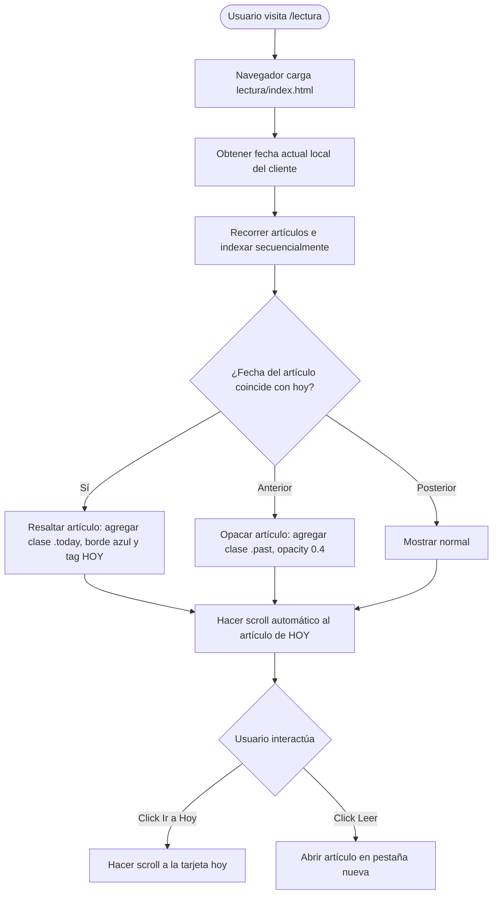

# Spec: Compilación Dinámica y Rediseño Dark Blueprint de la Sección /lectura

**Fecha:** 2026-06-22  
**Autor:** Antigravity  
**Estado:** Aprobado  
**Ruta:** [2026-06-22-lectura-dark-mode-design.md](file:///c:/dev/dr-cv/laboratorio/superpowers/specs/2026-06-22-lectura-dark-mode-design.md)  
**Companion HTML:** [2026-06-22-lectura-dark-mode-design.html](file:///c:/dev/dr-cv/laboratorio/superpowers/specs/2026-06-22-lectura-dark-mode-design.html)

---

## 1. Propósito y Objetivos
Integrar la ruta de lectura profesional (`/lectura`) dentro de la estructura de compilación del portafolio del usuario (`danilorojas.design/lectura`), aplicando la estética premium **Dark Blueprint** de su Design System y automatizando la sincronización de contenidos.

### Objetivos de Negocio / Carrera
* Presentar la ruta de lectura como evidencia del rigor teórico y técnico del usuario en Product Design e ingeniería de agentes de IA.
* Mantener una experiencia de usuario cómoda y de baja fatiga visual para leer extractos y hacer click hacia los artículos externos.

---

## 2. User Flow Diagram



---

## 3. Especificación Técnica

### 3.1 Parser de Contenido (`generadores/lib/parse-lectura.ts`)
Para evitar duplicación de información, escribiremos un script en TypeScript para parsear `lectura/ruta_lectura_product_design_ai_agents.md`. El formato a analizar es el siguiente:
1. **Bloques:** Líneas que inician con `# BLOQUE [N] — [Nombre]`.
2. **Artículos:** Líneas que inician con `## [N]. [Título]`.
3. **Metadatos del Artículo:**
   * `**Link:** [URL]` (o similares)
   * `**Prioridad:** [Prioridad]`
   * `**Tiempo:** [Tiempo]`
4. **Resumen y Extracto:** Todos los párrafos y listas subsiguientes hasta el próximo bloque o artículo.

Retornará una estructura JSON:
```typescript
interface LecturaItem {
  title: string;
  url: string;
  badge: string;
  time: string;
  extract: string;
}

interface LecturaBlock {
  blockTitle: string;
  items: LecturaItem[];
}
```

### 3.2 HTML Template (`generadores/templates/lectura.ts`)
Generará el archivo HTML estático combinando:
* Estilos CSS inyectados para el tema **Dark Blueprint** (fondo `#030303`, bordes técnicos de `rgba(255, 255, 255, 0.08)`, retícula de fondo `.bg-grid` de `80px`, cruces decorativas `.crosshair` en esquinas).
* Inyección de la estructura JSON de bloques y artículos generada por el parser.
* Código JS cliente para cálculo de fechas y resaltado de la lectura del día.

### 3.3 Integración de Builds (`generadores/v11-landing.ts`)
* Cambiar la ruta `/lectura/index.html` de ser un archivo manual copiado directamente en `handTools` a ser generado dinámicamente mediante la plantilla y el parser.
* Se mantendrá en el output path: `dist/landing-v11/lectura/index.html`.

---

## 4. Diseño Visual (Blueprint Dark)
* **Retícula:** Grid fijo `.bg-grid` con máscara radial para dar foco al contenido central.
* **Tipografía:**
  * Títulos de bloque y etiquetas en `JetBrains Mono` con tracking espaciado.
  * Título del artículo y descripción en `Inter`.
  * Viñetas personalizadas con un punto en color terracotta (`--v11-accent`).
* **Interacciones:**
  * Tarjetas de artículos con efecto `.metric-card:hover` y esquineras blueprint `.crosshair` que rotan 90 grados y aumentan de tamaño al posar el cursor.
  * Transición suave de opacidad para artículos ya leídos (`.past`).

---

## 5. Criterios de Aceptación
1. La única fuente de verdad para el contenido es `lectura/ruta_lectura_product_design_ai_agents.md`.
2. Al ejecutar `npm run build:landing-v11`, se parsea el Markdown y se genera `dist/landing-v11/lectura/index.html`.
3. El archivo generado no tiene dependencias a librerías externas de CSS o JS (carga rápida de fuente propia, Tailwind embebido o CSS custom).
4. El cálculo del día actual se ejecuta correctamente en el cliente y resalta la tarjeta de hoy.
5. El despliegue en Vercel funciona correctamente y sirve el sitio en `danilorojas.design/lectura`.
