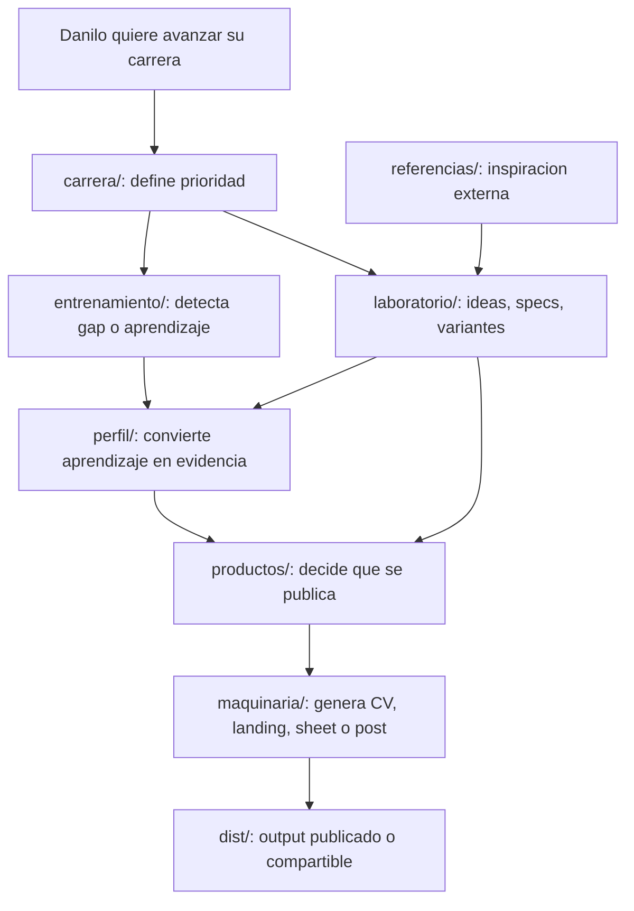

# Carrera Pro Repo Restructure Design

**Fecha:** 2026-06-11
**Repo:** `C:\dev\dr-cv`
**Estado:** Spec para revision, no implementada
**Objetivo:** convertir `dr-cv` en una maquina de carrera entendible, no solo una fabrica de CV/landing.

## Resumen

Este repo debe organizarse alrededor de la carrera de Danilo hacia USD 250k/ano. Lo publicable vive dentro de esa maquina, pero no manda la estructura. La estructura debe responder preguntas humanas:

- Que estoy intentando lograr?
- Que estoy entrenando?
- Que evidencia tengo?
- Que productos publico?
- Como se genera todo?
- Que probe y descarte?
- Que referencias externas use?

## Principio rector

El repo se ordena por **proposito de carrera**, no por tecnologia ni por output.

El modelo mental recomendado:

```text
carrera/ -> entrenamiento/ -> perfil/ -> productos/ -> maquinaria/ -> dist/
 decision     aprendizaje      evidencia   salidas       generacion     output
```

## Estructura propuesta

```text
dr-cv/
├── carrera/          <- centro de mando: estrategia, metas, semana, decisiones
├── entrenamiento/    <- UR training, assessment, gaps, progreso
├── perfil/           <- fuente de verdad profesional: data + assets propios
├── productos/        <- CV, landing, posts, skills sheet, todo lo publicable
├── maquinaria/       <- generators, templates, renderers, scripts
├── sistema/          <- design system unico activo
├── dist/             <- outputs generados, no se edita a mano
├── laboratorio/      <- pruebas, specs, plans, exploraciones, variantes
├── referencias/      <- inspiracion externa, read-only
└── tests/            <- pruebas automatizadas de la maquinaria
```

## Traduccion desde el repo actual

| Actual | Propuesto | Motivo |
|---|---|---|
| `estrategia/` | `carrera/` | Es el centro de mando real. |
| `UR_training/` | `entrenamiento/ur-assessment/` | Es aprendizaje/diagnostico, no producto final. |
| `data/` | `perfil/data/` | Es evidencia/texto profesional propio. |
| `assets/` | `perfil/assets/` | Son assets propios usados para publicar. |
| `productos/` | `productos/` | Ya expresa salidas humanas publicables. |
| `generators/` | `maquinaria/generators/` | Es codigo de generacion, no contenido. |
| `design-system/` | `sistema/design-system/` | Es infraestructura visual activa. |
| `pruebas/` | `laboratorio/` | Es exploracion, variantes y memoria de trabajo. |
| `referencias/` | `referencias/` | Ya expresa inspiracion externa. |
| `dist/` | `dist/` | Sigue siendo output generado. |
| `tests/` | `tests/` | Sigue probando la maquinaria. |
| `node_modules/` | `node_modules/` | Dependencias instaladas; no se navega mentalmente. |

## Contratos por carpeta

### `carrera/`

Responde: "Que hago ahora y por que?"

Contiene:

- Plan maestro.
- Semana actual.
- Metas, metricas y reviews.
- Decisiones de carrera.
- Daily tracker si sigue siendo operativo.

No contiene:

- Codigo de apps externas.
- Outputs generados.
- Referencias ajenas.

### `entrenamiento/`

Responde: "Que estoy aprendiendo para subir de nivel?"

Contiene:

- Assessment UR.
- Preguntas y respuestas.
- Gaps detectados.
- Planes de capacitacion.
- Futuro tracking de progreso.

Regla futura: si assessment/daily necesitan sincronizacion multi-dispositivo seria, migrar estado a base de datos real. No hacerlo dentro de esta reestructura.

### `perfil/`

Responde: "Que evidencia profesional tengo sobre mi?"

Contiene:

- `data/`: identidad, experiencia, casos, skills, testimonials, posicionamiento.
- `assets/`: foto, animaciones, stills propios.

No contiene:

- Plantillas de generacion.
- Pruebas descartadas.
- Referencias externas.

### `productos/`

Responde: "Que le muestro al mundo?"

Contiene:

- Documentacion humana de CV.
- Landing.
- Skills sheet.
- Posts de LinkedIn/social.
- Mockups finales o referencias finales del producto.

No contiene:

- Codigo de generadores.
- Outputs regenerables.

### `maquinaria/`

Responde: "Como se transforma el perfil en productos?"

Contiene:

- Generators.
- Templates.
- Renderers PDF/OG.
- Scripts utilitarios.

Regla: si un path cambia en `perfil/`, la maquinaria se actualiza en la misma fase.

### `sistema/`

Responde: "Cual es el lenguaje visual activo?"

Contiene un solo sistema activo, con targets para salidas distintas:

- `sistema/design-system/tokens-print.css` para CVs y skills sheet.
- `sistema/design-system/tokens-web.css` para landing y productos web.
- `sistema/design-system/README.md` con reglas cortas de uso.

Esto cuenta como un solo design system porque comparte ownership, reglas y vocabulario. Lo que cambia es el target: documento impreso vs web.

### `dist/`

Responde: "Que se genero?"

Reglas:

- No se edita a mano.
- `npm run build:all` debe poder regenerar lo importante.
- `/app` y `/daily` siguen vivos por URL directa, pero no se enlazan desde la landing principal.

### `laboratorio/`

Responde: "Que probe, que descarte, que estoy pensando?"

Contiene:

- Specs.
- Plans.
- Visual explorations.
- Audits.
- Prompts guardados.
- Landing explorations historicas.

Regla: todo lo que no sepas donde va en 10 segundos cae aqui hasta que madure.

### `referencias/`

Responde: "Que cosas externas inspiran este trabajo?"

Contiene:

- Snapshots de Huly u otros sitios.
- Research visual externo.
- Notas sobre referencias.

Regla: read-only. Si hay anotaciones propias, van en `referencias/notes/`.

### `tests/`

Responde: "Que asegura que la maquinaria no rompa las salidas?"

Contiene:

- Tests de carga de data.
- Tests de templates.
- Tests de CVs.
- Tests de landing.
- Tests de tipos.

No se mezcla con pruebas exploratorias humanas; eso vive en `laboratorio/`.

## User flow diagram



## Ejemplos de navegacion

| Quiero... | Donde empiezo |
|---|---|
| Saber que toca esta semana | `carrera/execution/current-week.md` |
| Seguir respondiendo el assessment | `entrenamiento/ur-assessment/` |
| Cambiar mi posicionamiento | `perfil/data/positioning.yaml` |
| Editar un caso de portfolio | `perfil/data/cases/` |
| Cambiar la landing publicada | `productos/landing/` para intencion, `maquinaria/generators/` para implementacion |
| Cambiar estilo visual activo | `sistema/design-system/` |
| Ver outputs finales | `dist/` |
| Buscar variantes descartadas | `laboratorio/` |
| Buscar inspiracion de otra pagina | `referencias/` |
| Entender por que algo no se rompe | `tests/` |

## Rutas e invariantes que no se deben romper

- `npm run build:skills-sheet`
- `npm run build:cvs`
- `npm run build:landing-v11`
- `npm run build:all`
- `npm test`
- `npm run typecheck`
- `danilorojas.design/`
- `danilorojas.design/es/`
- `danilorojas.design/work/*`
- `danilorojas.design/app`
- `danilorojas.design/daily`

## Fases de migracion propuestas

### Fase 1 - Mapa y aliases mentales

- Crear `README.md` raiz con el modelo Carrera Pro.
- Actualizar `AGENTS.md` y `CLAUDE.md`.
- No mover carpetas todavia.

Objetivo: que Danilo y agentes naveguen igual antes de tocar paths.

### Fase 2 - Mover contenido no tecnico

- `estrategia/` -> `carrera/`
- `UR_training/` -> `entrenamiento/ur-assessment/`
- `pruebas/` -> `laboratorio/`

Actualizar links internos.

### Fase 3 - Mover fuentes profesionales

- `data/` -> `perfil/data/`
- `assets/` -> `perfil/assets/`

Actualizar maquinaria y tests.

### Fase 4 - Mover maquinaria y sistema

- `generators/` -> `maquinaria/generators/`
- `design-system/` -> `sistema/design-system/`
- `design-system/tokens.css` -> `sistema/design-system/tokens-print.css`
- `design-system/tokens-v11.css` -> `sistema/design-system/tokens-web.css`

Actualizar scripts de `package.json`, imports y tests.

### Fase 5 - Verificacion y limpieza

- Ejecutar `npm run build:all` fuera del sandbox si Puppeteer lo necesita.
- Ejecutar `npm test`.
- Ejecutar `npm run typecheck`.
- Confirmar hashes/copia de `/app` y `/daily`.
- Commit final de migracion.

## Riesgos

| Riesgo | Mitigacion |
|---|---|
| Romper paths hard-coded | Migrar por fases y correr build/tests en cada fase. |
| Perder `/app` o `/daily` | Mantener fuentes reales y copy step en landing build. |
| Mezclar laboratorio con producto | Contratos por carpeta y README raiz claro. |
| Hacer una mudanza gigante incomprensible | Commits por fase, cada uno verificable. |
| Convertir el repo en proyecto infinito | Fases cerradas; no redisenar contenido durante la migracion. |

## No objetivos

- No cambiar contenido profesional.
- No redisenar landing/CV.
- No migrar a base de datos real todavia.
- No proteger rutas `/app` y `/daily`.
- No borrar referencias historicas sin decision separada.

## Criterios de aceptacion

- Danilo puede responder "donde busco X?" en menos de 10 segundos.
- Un agente nuevo entiende la estructura leyendo `README.md` + `AGENTS.md`.
- `dist/` sigue siendo output, no fuente mental.
- Los productos publicados siguen generandose.
- Las exploraciones quedan disponibles, pero no compiten con la maquina principal.

## Recomendacion

Aprobar este modelo y pasar a un plan de implementacion por fases. La primera implementacion debe ser conservadora: actualizar documentacion y crear un mapa de aliases antes de mover carpetas grandes.
